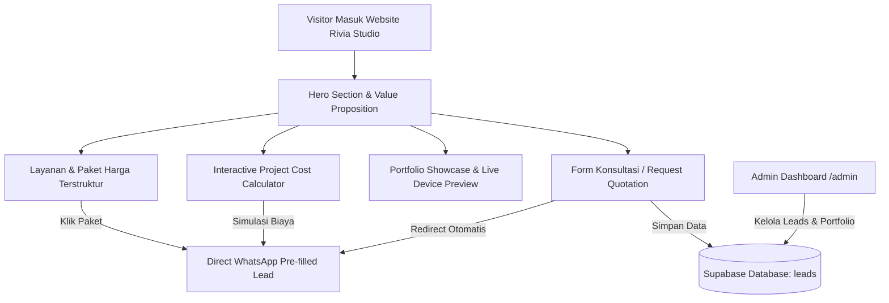

# Rivia Studio - Full-Stack Web & App Development Agency Platform

Membangun platform website resmi dan *conversion landing page* untuk **Rivia Studio** (Jasa Pembuatan Website & Aplikasi Profesional) yang mengadopsi referensi visual *Cosmic Sapphire & Royal Cyber Aesthetic* dari poster referensi, dipadukan dengan strategi konversi direct-response WhatsApp dan integrasi backend Supabase & Vercel.

---

## User Review Required

> [!IMPORTANT]
> **Kontak & Identitas Brand yang Digunakan (Berdasarkan Gambar):**
> - **Nama Brand:** **RIVIA STUDIO** *(Web Design • UI/UX Design • SEO • Ecommerce • LMS • Mobile Apps)*
> - **WhatsApp:** `+62 8222-68-000-63` (`6282226800063`)
> - **Email:** `kiyerivia@gmail.com`
> - **Aset Visual:** Nuansa *Deep Cosmic Sapphire Blue* dengan efek *Neon Cyan Glow*, *Gold Metallic Typography*, serta *Glassmorphism Cards*.

> [!TIP]
> **Integrasi Supabase & Mode Zero-Config:**
> Proyek akan disiapkan dengan koneksi Supabase resmi. Jika kredensial Supabase (`NEXT_PUBLIC_SUPABASE_URL` dan `NEXT_PUBLIC_SUPABASE_ANON_KEY`) belum dimasukkan oleh Anda di `.env.local`, aplikasi akan otomatis menggunakan **Smart Fallback Data & Local Storage** sehingga website langsung bisa berjalan 100% sempurna tanpa error saat dideploy ke Vercel.

---

## Fitur Utama yang Akan Dibangun



1. **Header & Navigation (Glassmorphic Bar):**
   - Logo Cyber Emblem Rivia Studio, menu navigasi cepat (Layanan, Portfolio, Biaya, Alur Kerja, FAQ), tombol quick action WhatsApp & Kontak.
2. **Hero Section (High Impact):**
   - Headline: *"Jasa Pembuatan Website & Aplikasi Profesional - Wujudkan Website Impian Anda Bersama Rivia Studio!"*
   - Interactive 3D/Floating Web Mockup Cards (Company Profile, E-Commerce, LMS, Healthcare, Travel).
   - Trust Badges: *Kualitas Terbaik • Harga Terjangkau • Support 24/7 • 100% Kepuasan Terjamin*.
3. **Katalog Layanan Digital Lengkap:**
   - Landing Page Ads, Company Profile, E-Commerce, Portal Pendidikan/LMS, Portofolio Kreatif, Custom Web App/Sistem Informasi, & Mobile App (Android/iOS).
4. **Interactive Cost Estimator (Kalkulator Biaya Proyek):**
   - Calon klien dapat memilih jenis website, fitur (Payment Gateway, Login/Auth, Multi-bahasa, SEO Booster, CMS Admin, Maintenance).
   - Tampilan estimasi harga dinamis + tombol *"Pesan Paket Ini via WhatsApp"* dengan ringkasan fitur otomatis terformat di chat WhatsApp.
5. **Pricelist Bertingkat (Direct WhatsApp Conversion):**
   - Paket Promo / Minisite (Rp 499.000)
   - Paket Standar UMKM (Rp 1.250.000)
   - Paket Bisnis Pro / Medium (Rp 2.500.000)
   - Paket Custom Enterprise (Rp 4.900.000+)
   - Semua paket dilengkapi tombol pesan otomatis ke nomor `+62 8222-68-000-63`.
6. **Showcase Portfolio Interaktif:**
   - Filter kategori (Web, Mobile, E-Commerce, LMS).
   - Switcher tampilan Device Frame (Desktop, Tablet, Mobile) & Live Demo preview.
7. **SOP Alur Kerja 5 Langkah (Transparent Workflow):**
   - Konsultasi ➔ DP 50% ➔ Pengerjaan & Desain ➔ Revisi ➔ Pelunasan & Serah Terima + Garansi 1 Tahun.
8. **Form Konsultasi Terintegrasi Supabase:**
   - Menyimpan lead konsultasi ke Supabase Table `leads` dan mengirim notifikasi WhatsApp langsung.
9. **Admin Leads Inbox (`/admin`):**
   - Halaman khusus untuk melihat daftar calon klien yang masuk, status follow-up, dan estimasi nilai proyek.
10. **Social Proof & Live Sales Toast:**
    - Animasi popup penjualan berkala di pojok layar untuk meningkatkan kepercayaan calon klien.
11. **Floating WhatsApp Button:**
    - Tombol WhatsApp melayang dengan badge status online & dialog chat interaktif.

---

## Proposed Technical Changes

### Arsitektur Proyek: Next.js 14 App Router + Tailwind CSS + Supabase

```
/
├── app/
│   ├── layout.tsx              # Root layout, Google Fonts (Outfit & Plus Jakarta Sans), SEO metadata
│   ├── page.tsx                # Main Landing Page (Hero, Services, Calculator, Pricing, Portfolio, Steps, FAQ)
│   ├── admin/                  # Admin Dashboard for Leads & Inquiries
│   │   └── page.tsx
│   ├── api/
│   │   └── leads/route.ts      # Serverless API endpoint for handling lead submissions
│   └── globals.css             # Glassmorphism, Neon Glow Utilities, Custom Animations
├── components/
│   ├── Navbar.tsx              # Sticky Glassmorphic Navigation
│   ├── Hero.tsx                # Impactful Hero with floating mockups & Rivia emblem
│   ├── Services.tsx            # Grid of Services with glow hover effects
│   ├── CostCalculator.tsx      # Dynamic project budget estimator & custom WA generator
│   ├── Pricing.tsx             # Tiered Pricing packages with WhatsApp pre-filled text
│   ├── Portfolio.tsx           # Filterable Case studies with device frame previews
│   ├── Workflow.tsx            # 5-Step Order SOP process
│   ├── ConsultationForm.tsx    # Supabase-connected lead capture form
│   ├── Testimonials.tsx        # Client reviews & trust score
│   ├── LiveSalesNotification.tsx # Social proof notification toaster
│   ├── FloatingWhatsApp.tsx    # Quick contact floating widget
│   └── Footer.tsx              # Legal info, sitemap, contact details, copyright
├── lib/
│   ├── supabase.ts             # Supabase client & fallback data store
│   └── whatsapp.ts             # WhatsApp message template builder
├── supabase/
│   └── schema.sql              # SQL schema script for Supabase tables (leads, portfolio, settings)
├── public/
│   ├── images/                 # Portfolio previews & assets
│   └── favicon.ico
├── package.json
├── tailwind.config.ts
├── tsconfig.json
├── next.config.js
└── vercel.json                 # Vercel deployment configuration
```

---

## Verification Plan

### 1. Automated & Build Checks
- Inisialisasi Next.js project & instalasi dependencies (`@supabase/supabase-js`, `lucide-react`, `canvas-confetti`, `clsx`, `tailwind-merge`).
- Jalankan `npm run build` untuk memverifikasi TypeScript types dan static build output tanpa error.

### 2. Functional & UI Verification
- Jalankan local dev server `npm run dev` dan uji di browser:
  - **Tampilan Visual:** Verifikasi palet warna Cosmic Blue, Royal Gold, dan glowing elements sesuai referensi poster Rivia Studio.
  - **Kalkulator Biaya:** Ubah pilihan checklist fitur dan pastikan harga total terhitung akurat dan link WhatsApp yang dihasilkan memuat teks yang sesuai.
  - **Paket Harga:** Klik tiap tombol paket untuk memastikan nomor tujuan `6282226800063` dan template teks benar.
  - **Form Konsultasi:** Kirim data form dan periksa penyimpanan lead (ke Supabase / local storage) serta notifikasi sukses.
  - **Admin Inbox:** Buka `/admin` dan periksa data lead yang baru dikirim.
  - **Responsivitas:** Uji tampilan di viewport Mobile (375px) dan Desktop (1440px).

### 3. Vercel & Supabase Deployment Readiness
- Berikan panduan langkah demi langkah untuk:
  1. Menghubungkan repo GitHub ke Vercel (1-Click Deploy).
  2. Menjalankan SQL script di Supabase SQL Editor.
  3. Mengatur environment variables di dashboard Vercel.
